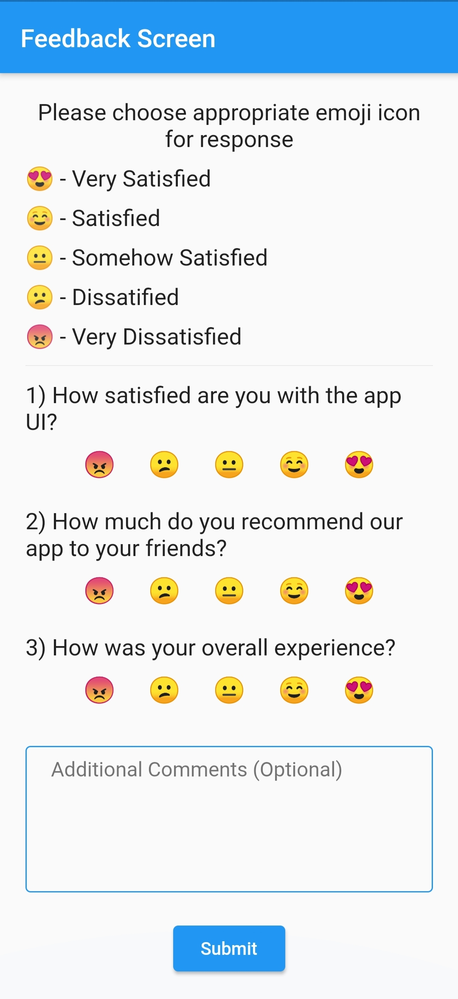

# flutter_radio_emoji
Sometimes we need feedback from users and flutter provides a lot of ease in creating beautiful UIs. This project is all about creating a beautiful feedback form in flutter making use of radio buttons with a twist of emojis.

Medium article: <a href="https://medium.com/@priyank-kumar-singh/build-beautiful-feedback-form-with-radio-emojis-in-flutter-2a515e913fbc">medium.com/@priyank-kumar-singh/flutter-feedback-form </a>

Before starting go ahead and clone the project from my github repository <a href="https://github.com/priyank-kumar-singh/flutter_radio_emoji">github.com/priyank-kumar-singh/flutter_radio_emoji</a>

You’ll find following files inside lib folder-
1. main.dart
2. form_field.dart
3. radio_emoji.dart
 ...
 ...
 ...

Read full article on medium: <a href="https://medium.com/@priyank-kumar-singh/build-beautiful-feedback-form-with-radio-emojis-in-flutter-2a515e913fbc">medium.com/@priyank-kumar-singh/flutter-feedback-form </a>

For more detailed explanation and more amazing stuff do check out my youtube channel: https://www.youtube.com/channel/UCNdptkGGmUsmjuIL8sQ5NpA
